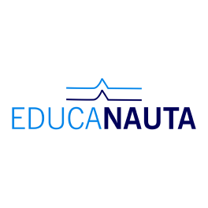

<h1 align="center">
    
</h1>


<h2 align="center">Educanauta - Mega Hack 3</h2>
<p align="center">	
  
  
  
  

  <a href="https://github.com/jpsoarxs/MH-3/commits/master">
    
  </a>

</p>

<p align="center">
  <a href="#information_source-o-que-é-o-educanauta-">Educanauta</a>&nbsp;&nbsp;&nbsp;|&nbsp;&nbsp;&nbsp;
  <a href="#-project">Project</a>&nbsp;&nbsp;&nbsp;|&nbsp;&nbsp;&nbsp;
  <a href="#-technologies">Technologies</a>&nbsp;&nbsp;&nbsp;|&nbsp;&nbsp;&nbsp;
  <a href="#information_source-how-to-use">How to use</a>
  <!-- <a href="#memo-license">License</a> -->
</p>

## :information_source: O que é o Educanauta ?

Projeto feito em conjunto no Mega Hack 3 da [Shawee][shawee] em resposta ao desafio da VOLUME & WILSON SONS.

## 💻 Project

O projeto "EDUCANAUTA" procura atender a necessidade de instruir os trabalhadores embarcados com acesso restrito à internet, a aplicação ficaria conectada em um servidor local dentro da embarcação, onde os cursos poderiam ser acessados pelos celulares dos tripulantes através do IP e sem a necessidade de uma boa conexão com internet.


## :cinema: Pitch
<a href="https://www.youtube.com/watch?v=xAMAlWSk7SQ&feature=youtu.be" target="_blank"></a>


## 💻 Technologies

This project was developed with the following technologies:

- [ReactJs][reactjs]
- [Styled-components][styledcomp]
- [Sqlite3][sqlite3]
- [Multer][multer]
- [Express][express]

## :information_source: How To Use

To clone and run this application, you'll need [Git](https://git-scm.com) + [Yarn][yarn] installed on your computer.

From your command line:

### First, clone this repository
```bash
$ git clone https://github.com/tiagoarodrigues55/MegaHack.git
```

### Install and run the api 

```bash
# Go into the repository
$ cd server

# Install dependencies
$ yarn install

# Starts the server
$ yarn dev
```
### Open another terminal and run:

```bash
# Go into the repository
$ cd web

# Install dependencies
$ yarn install

# Starts the web application
$ yarn start
```
[shawee]: https://shawee.io/pt/
[nodejs]: https://nodejs.org/
[yarn]: https://yarnpkg.com/
[reactJs]: https://reactjs.org/docs/getting-started.html
[styledcomp]: https://styled-components.com/
[multer]: https://www.npmjs.com/package/multer
[sqlite3]: https://www.npmjs.com/package/sqlite3
[express]: https://expressjs.com/
